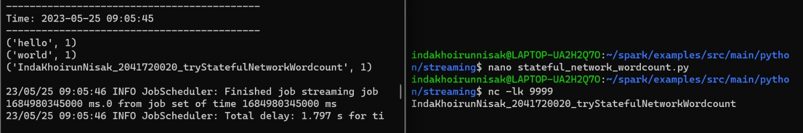

### Praktikum
#### Praktik Dasar Spark Streaming
Metode 1: Mode Stateless Stream Processing

- Mengubah interval waktu menjadi per 5 detik

Metode 2: Mode Stateful Stream Processing

#### Melakukan Transformasi di Spark Streaming

### Tugas Praktikum

# Tugas Praktikum
<ol>
  <li>Jelaskan perbedaan Spark Streaming dengan metode stateless dan stateful stream processing?</li>  
    

      Stateless Stream Processing: 
Stateless stream processing dalam Spark Streaming tidak menyimpan atau mengingat informasi atau data yang telah diproses sebelumnya. Setiap data yang masuk dianggap sebagai entitas yang mandiri dan diproses secara terpisah. Ini berarti bahwa setiap data diproses secara independen, tidak memerlukan informasi dari data sebelumnya untuk menghasilkan hasil yang akurat.
Contoh penggunaan stateless stream processing adalah ketika ingin melakukan transformasi atau operasi sederhana pada setiap data yang masuk, seperti pemetaan (mapping) atau filtrasi (filtering). Setiap data dianggap sebagai entitas terpisah, dan tidak ada kebutuhan untuk menyimpan status sebelumnya.

Stateful Stream Processing: 
Stateful stream processing dalam Spark Streaming melibatkan penyimpanan informasi atau data sebelumnya selama aliran data. Dalam metode ini, Spark Streaming memungkinkan pengguna untuk menyimpan dan menggunakan informasi atau data historis dalam pemrosesan data streaming saat ini.
Misalnya, dalam kasus penghitungan frekuensi kemunculan kata-kata dalam aliran teks,kita perlu mengingat dan memperbarui jumlah kata-kata yang muncul sebelumnya saat aliran data berlanjut. Informasi ini disimpan dalam status (state) dan diperbarui setiap kali data baru masuk. Dengan menggunakan status sebelumnya, Anda dapat melacak dan memperbarui hasil dengan akurat dalam pemrosesan streaming yang berkelanjutan.
     

  <li>Jelaskan masing-masing maksud kode berikut sesuai nomor kodenya pada laporan praktikum Anda!</li>
</ol>

<ol>
  <li>
    

      <strong>- sys.argv:</strong> Ini adalah daftar dalam modul sys di Python yang memberikan akses ke argumen baris perintah yang dilewatkan ke sebuah skrip. Ini memungkinkan kita untuk mengakses argumen yang dilewatkan ke skrip Python saat dieksekusi dari baris perintah.
    

    

      <strong>- sys.stderr:</strong> Ini adalah objek mirip file dalam modul sys di Python yang mewakili aliran kesalahan standar. Digunakan untuk mencetak pesan kesalahan dan informasi traceback.
    

    

      <strong>- StreamingContext:</strong> Ini adalah kelas dalam modul Streaming Apache Spark yang digunakan untuk membuat DStream, yang merupakan Discretized Stream. DStream mewakili aliran data kontinu dalam Spark.
    

    

      <strong>- sc:</strong> Ini adalah objek dalam Apache Spark yang mewakili SparkContext. SparkContext adalah titik masuk untuk semua fungsionalitas Spark. Digunakan untuk membuat RDD (Resilient Distributed Datasets) dan melakukan operasi pada mereka.
    

    

      <strong>- socketTextStream:</strong> Ini adalah fungsi dalam Apache Spark Streaming yang membuat DStream dengan mendengarkan soket untuk data. Membaca data teks yang diterima melalui soket sebagai aliran baris masukan.
    

    

      <strong>- reduceByKey:</strong> Ini adalah operasi transformasi dalam Apache Spark yang digunakan pada pasangan RDD untuk menggabungkan nilai-nilai setiap kunci menggunakan fungsi reduce yang ditentukan. Mengelompokkan nilai-nilai setiap kunci dan menerapkan fungsi reduce pada nilai-nilai yang dikelompokkan.
    

    

      <strong>- lambda line:</strong> Ini adalah fungsi lambda dalam Python yang mengambil parameter bernama 'line' dan mewakili fungsi anonim. Dapat digunakan untuk mendefinisikan fungsi kecil satu baris tanpa nama.
    

    

      <strong>- awaitTermination:</strong> Ini adalah metode dalam StreamingContext Apache Spark yang memblokir thread saat ini sampai konteks streaming dihentikan secara eksplisit atau terjadi pengecualian.
    

  </li>
  <li>
    

      <strong>- nc:</strong> Ini merujuk pada perintah "nc" atau "netcat" di Linux. Ini adalah utilitas yang digunakan untuk membaca dari dan menulis ke koneksi jaringan. Dalam konteks data streaming, "nc" sering digunakan untuk mengatur soket jaringan yang berfungsi sebagai sumber data.
    

    

      <strong>- lk:</strong> Istilah "lk" tidak memiliki arti standar atau diakui secara luas dalam konteks pemrograman atau pemrosesan data. Tanpa konteks tambahan, sulit untuk menentukan arti spesifiknya.
    

  </li>
  <li>
    

      <strong>- spark-submit:</strong> Ini adalah alat baris perintah yang disediakan oleh Apache Spark yang digunakan untuk mengirimkan aplikasi Spark ke sebuah kluster. Ini mengambil file JAR atau file Python aplikasi sebagai input dan meluncurkan aplikasi di kluster.
    

    

      <strong>- master:</strong> Ini adalah parameter yang digunakan dengan spark-submit untuk menentukan alamat manajer kluster. Ini menentukan di mana aplikasi Spark harus dijalankan.
    

    

      <strong>- local[*]:</strong> Ini adalah nilai khusus untuk parameter "master" dalam Apache Spark yang menunjukkan aplikasi harus dijalankan secara lokal pada semua core yang tersedia. Sering digunakan untuk pengembangan dan pengujian lokal.
    

  </li>
  <li>
    

      <strong>- ssc.checkpoint:</strong> Ini adalah metode dalam StreamingContext Apache Spark yang mengatur direktori di mana sistem streaming akan menulis file checkpoint. Checkpointing digunakan untuk toleransi kesalahan dan pemulihan dalam aplikasi streaming.
    

    

      <strong>- parallelize:</strong> Ini adalah metode dalam SparkContext Apache Spark yang digunakan untuk membuat RDD dari koleksi data dalam program pengemudi. Mendistribusikan data ke beberapa partisi untuk memungkinkan pemrosesan paralel.
    

    

      <strong>- updateStateByKey:</strong> Ini adalah operasi transformasi dalam Apache Spark Streaming yang memungkinkan kita untuk mempertahankan informasi status sembarang di beberapa batch data. Digunakan untuk memperbarui status suatu kunci berdasarkan data masukan baru dan fungsi pembaruan yang ditentukan oleh pengguna.
    

    

      <strong>- flatMap:</strong> Ini adalah operasi transformasi dalam Apache Spark yang digunakan untuk mengubah setiap elemen RDD menjadi nol atau lebih elemen keluaran. Mengambil fungsi sebagai argumen dan menerapkannya pada setiap elemen masukan untuk menghasilkan elemen keluaran.
    

  </li>
  <li>
    

      <strong>- rdd.take(5):</strong> Ini adalah metode dalam RDD Apache Spark yang mengembalikan lima elemen pertama dari RDD.
    

  </li>
</ol>

